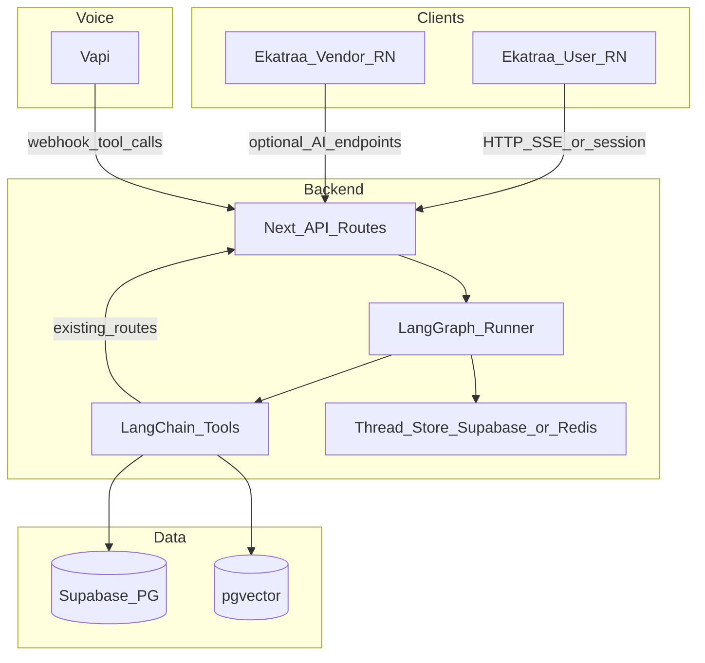
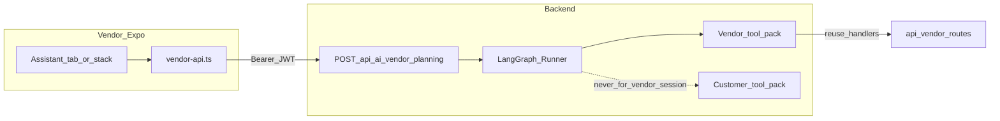

> **Stack update:** Implementation should follow **Mastra** (TypeScript agents, tools, workflows) in **ekatraa_backend**, per the [Mastra quickstart](https://mastra.ai/guides/getting-started/quickstart) and [Next.js guide](https://mastra.ai/guides/getting-started/next-js)—not LangGraph/LangChain or Agno. **ekatraa-web** remains the **primary** chat surface; optional **Vercel AI SDK** (`ai`, `useChat` / `streamText`) where it composes cleanly with Mastra streams. Current todos and architecture detail: Cursor plan **Mastra Event OS Plan** (workspace-relative copy may live under `.cursor/plans/`; the maintained file is the Cursor-generated plan whose body is Mastra—see latest plan sync in chat).

# Agentic AI Event Planning OS — Architecture & Implementation Plan

## Current state (grounded in repo)

| System                                                                              | Relevant facts                                                                                                                                                                                                                                                                                                                                                                                                                                                                                                                            |
| ----------------------------------------------------------------------------------- | ----------------------------------------------------------------------------------------------------------------------------------------------------------------------------------------------------------------------------------------------------------------------------------------------------------------------------------------------------------------------------------------------------------------------------------------------------------------------------------------------------------------------------------------- |
| [ekatraa](file:///Users/ZantrikTechnologies/Desktop/Others/ekatraa)                 | [`ChatModal.js`](file:///Users/ZantrikTechnologies/Desktop/Others/ekatraa/src/components/ChatModal.js) calls [`api.postAiChat`](file:///Users/ZantrikTechnologies/Desktop/Others/ekatraa/src/services/api.js) → **stateless** text chat. [`Home.js`](file:///Users/ZantrikTechnologies/Desktop/Others/ekatraa/src/screens/home/Home.js) owns event form, recommendations, categories, cart navigation.                                                                                                                                    |
| [ekatraa_backend](file:///Users/ZantrikTechnologies/Desktop/Others/ekatraa_backend) | Next.js app: [`/api/public/ai/chat`](file:///Users/ZantrikTechnologies/Desktop/Others/ekatraa_backend/src/app/api/public/ai/chat/route.ts) uses **Anthropic SDK** + [`getAiAppCatalogContext`](file:///Users/ZantrikTechnologies/Desktop/Others/ekatraa_backend/src/lib/ai-app-context) (not LangChain). Budget/category logic exists in [`/api/public/recommendations`](file:///Users/ZantrikTechnologies/Desktop/Others/ekatraa_backend/src/app/api/public/recommendations/route.ts). **No `pgvector` / embeddings** in codebase today. |
| [ekatraa_vendor](file:///Users/ZantrikTechnologies/Desktop/Others/ekatraa_vendor)   | Expo Router + **Supabase** auth; [`lib/vendor-api.ts`](file:///Users/ZantrikTechnologies/Desktop/Others/ekatraa_vendor/lib/vendor-api.ts) calls **`/api/vendor/*`** with `Authorization: Bearer` (session). Good hook for **vendor planning API** alongside existing orders fetch. No AI assistant UI yet.                                                                                                                                                                                                                                |

**Implication:** You are not starting from zero—you have catalog-aware chat and deterministic recommendation math. The new work is **orchestration**, **structured state**, **tool boundaries**, **vector search**, and **voice**—implemented so the LLM never talks to the DB except through tools/APIs.

---

## Target architecture

**Deployment note (critical):** LangGraph runs can exceed typical **serverless** timeouts on cold paths. Plan for either: (1) a **dedicated Node** service (same repo or small `packages/ai-worker`) for graph + Vapi webhooks, with Next.js proxying auth, or (2) Next.js **streaming** routes only for short steps + **async jobs** (queue + polling) for long vendor matching. Decide in Phase 2 before Vapi production traffic.

---

## Design principles (from your spec, enforced in code)

1. **No LLM → raw DB.** All reads/writes go through **typed tools** that call existing handlers or thin service functions (Supabase server client stays server-side).
2. **LangGraph is the brain:** nodes = stages (intake → plan → budget → match → cart proposal → human gate); edges = branching + revision loops.
3. **Modular agents:** implement as **graph nodes + tool sets**, not one mega prompt. “Deep multi-agent collaboration” maps to **supervisor / handoff** patterns in LangGraph JS, not a single `createAgentExecutor` (API names change; bind to **LangGraph** primitives).
4. **Memory:** `thread_id` (user + optional `cart_id` / `plan_version`); persist checkpoints in **Supabase** (JSON state table) or **Redis** if you need sub-10ms TTL; **LangSmith** for tracing only (no PII in traces without redaction policy).

---

## Vendor app agentic system (first-class)

Vendors are not a late-phase stub: they use the **same** `GraphRunner` and design principles, with a **vendor actor** boundary so tool lists and prompts cannot invoke customer-only mutations.

**Authentication and isolation**

- **Client:** Extend [`lib/vendor-api.ts`](file:///Users/ZantrikTechnologies/Desktop/Others/ekatraa_vendor/lib/vendor-api.ts) with `postVendorPlanningMessage` / optional SSE reader—same pattern as `fetchVendorOrders` (Bearer from Supabase session).
- **Server:** New routes e.g. `POST /api/ai/vendor/planning/message` (names TBD) **require vendor JWT** and resolve `vendor_id` the same way existing [`/api/vendor/orders`](file:///Users/ZantrikTechnologies/Desktop/Others/ekatraa_vendor/lib/vendor-api.ts) handlers do. **Inject `vendor_id` into tool context**; reject or ignore any model-provided vendor identifier.
- **Graph shape:** Implement either (a) a **`vendorPlanning` subgraph** (clean separation, shared checkpoint store), or (b) one graph with a **router node** that selects `tool_pack: "vendor" | "customer"` from session metadata. Prefer (a) if customer and vendor state schemas diverge.

**Vendor tool packs (evolve with phases)**

| Phase | Tools (examples)                                                                                                              | Mutations                                                                                                                               |
| ----- | ----------------------------------------------------------------------------------------------------------------------------- | --------------------------------------------------------------------------------------------------------------------------------------- |
| 1–2   | Orders list/detail, service catalog snapshot for their listings, availability/blackouts if API exists, “summarize this order” | Read-only                                                                                                                               |
| 3     | Same + voice (optional Vapi) with **identical tool names/args** as text                                                       | Read-only                                                                                                                               |
| 4     | Draft quote reply, suggested schedule slot, suggested line-item note                                                          | **Human-gated:** return `draft_*` + `needs_vendor_confirm`; persist only after explicit UI confirm (mirror customer cart approval gate) |

**Vendor app UI ([ekatraa_vendor](file:///Users/ZantrikTechnologies/Desktop/Others/ekatraa_vendor))**

- Add an **Assistant** entry (e.g. `app/(tabs)/assistant.tsx` or `app/assistant/index.tsx`) with chat UI analogous to customer [`ChatModal`](file:///Users/ZantrikTechnologies/Desktop/Others/ekatraa/src/components/ChatModal.js): streaming or polled text, **structured blocks** (order summary cards, draft quote preview, apply/discard CTAs).
- **Feature flag** env (e.g. `EXPO_PUBLIC_AI_VENDOR_ASSISTANT`) so production can stay off until backend is ready.
- **No LangChain in the app**—HTTP only.

**Observability**

- LangSmith tags: `actor:vendor`, `vendor_id` (hashed if policy requires); redact customer names/phones in traces.

**Product boundaries**

- Avoid a global “search all customers” tool unless legal/product approves; prefer **order-scoped** context (customer details only as joined on an order the vendor already owns).

---

## Phase 1 — Foundation (1–2 weeks): LangChain + tools + text “planning session”

**Backend ([ekatraa_backend](file:///Users/ZantrikTechnologies/Desktop/Others/ekatraa_backend))**

- Add dependencies: `@langchain/core`, `@langchain/langgraph`, model provider(s) you choose (OpenAI / Anthropic via LangChain adapters—can coexist with existing direct Anthropic usage during migration).
- New module layout (suggested):
  - `src/lib/ai/graph/` — graph definition, state schema (Zod), routing
  - `src/lib/ai/tools/` — one file per tool family, each calling **existing** REST logic or extracted `lib/*` functions (avoid duplicating SQL)
  - `src/lib/ai/thread-store.ts` — load/save thread state
- **Tool wrappers (first batch, high value):**
  - `get_occasions` / `get_categories` / `get_services` — wrap same queries as public routes or import shared query helpers
  - `get_recommendations` — wrap logic from [`recommendations/route.ts`](file:///Users/ZantrikTechnologies/Desktop/Others/ekatraa_backend/src/app/api/public/recommendations/route.ts) (extract pure function + call from both HTTP and tool)
  - `get_vendors_preview` — align with [`api.getVendorsPreview`](file:///Users/ZantrikTechnologies/Desktop/Others/ekatraa/src/services/api.js) backend implementation
  - `create_or_update_cart` — wrap [`/api/public/cart`](file:///Users/ZantrikTechnologies/Desktop/Others/ekatraa_backend/src/app/api/public/cart/route.ts) patterns (server-side service, not HTTP hop from tool to self if avoidable)
- New **authenticated** (or device-scoped) route, e.g. `POST /api/ai/planning/session` (name TBD):
  - Input: `thread_id`, `message`, optional `client_context` (city, occasion_id, form snapshot)
  - Output: assistant text + **structured patch** (`plan_draft`, `suggested_cart_ops`, `needs_human_confirm`)
  - Keep existing `POST /api/public/ai/chat` for backward compatibility; optionally have it call the same graph with a “chat-only” mode flag.
- **Vendor (same phase, thin vertical slice):** stub `POST /api/ai/vendor/planning/message` that authenticates via vendor JWT and runs a **minimal graph** (e.g. single “echo” or read-only order list tool) so [`vendor-api.ts`](file:///Users/ZantrikTechnologies/Desktop/Others/ekatraa_vendor/lib/vendor-api.ts) integration can ship behind a flag.

**Customer app ([ekatraa](file:///Users/ZantrikTechnologies/Desktop/Others/ekatraa))**

- Extend [`ChatModal`](file:///Users/ZantrikTechnologies/Desktop/Others/ekatraa/src/components/ChatModal.js) (or add `PlanningSessionModal`) to:
  - Send **EventFormContext** / Home form snapshot in the payload (you already send `city`, `occasion_id`, `planned_budget_inr`)
  - Render **structured cards** when API returns JSON blocks (e.g. “Apply plan to cart” CTA)
- **Do not** embed LangChain in the mobile app; only HTTP + local UI state.

**Vendor app ([ekatraa_vendor](file:///Users/ZantrikTechnologies/Desktop/Others/ekatraa_vendor))**

- Phase 1: **Assistant (beta)** screen behind feature flag + `vendor-api` method calling the stub route; enough to validate auth, latency, and threading—not full product copy yet.

---

## Phase 2 — LangGraph workflow + budget/vendor agents + cart integration (2–3 weeks)

**Graph nodes (map to your 7 agents)**

| Your agent        | Graph responsibility                                                                                        |
| ----------------- | ----------------------------------------------------------------------------------------------------------- |
| Intake            | Normalize user + form → `PlanningState` (Zod); missing slots → ask user                                     |
| Planning          | Category/service **skeleton** (rule-first + LLM fill gaps); reuse recommendation allocations where possible |
| Budget allocation | Call extracted recommendation/budget helpers; allow overrides                                               |
| Vendor matching   | **Phase 2a:** keyword + filters + `get_vendors_preview`. **Phase 2b:** pgvector (below)                     |
| Negotiation       | Stub: suggest alternates from catalog (no autonomous price negotiation with vendors until policy exists)    |
| Cart builder      | Emit `cart_ops`: `{ add_line_items: [...] }` validated against real `service_id` + tier options             |
| Notification      | Server-side: enqueue notifications (existing Expo push patterns if any); no LLM sends WhatsApp              |

**Human approval gate**

- Graph stops at `awaiting_approval`; client shows diff; on confirm, server runs **checkout-safe** mutation path (reuse your cart APIs).

**Supabase: pgvector**

- Migration: enable `vector`, add `vendor_embeddings` or `offerable_service_embeddings` (entity, `embedding vector(...)`, metadata JSON, `updated_at`)
- Batch job (script or cron): embed vendor/service text fields; refresh on change
- New tool: `match_vendors_semantic` — `rpc` or SQL with similarity + hard filters (city, category, active)

**Security**

- Tools that mutate carts/orders require **user JWT** or **signed session** from the app; Vapi webhooks must verify **Vapi signature** and map to internal user id.
- **Vendor sessions:** require **vendor JWT**; tool implementations must match existing `/api/vendor/*` authorization checks (service role vs RLS as today).

**Vendor graph (parallel track in Phase 2)**

- Flesh out **vendorPlanning** graph nodes: intake (vendor intent), **read-only** tool calls (orders, services, availability), reply with structured summaries.
- Customer **match_vendors_semantic** and vendor **order explain** flows share embedding/infrastructure where useful but stay in separate tool packs.

---

## Phase 3 — Vapi voice (2 weeks)

- **Vapi → your backend:** tool definitions mirror LangChain tool schemas (names/args aligned).
- **Flow:** utterance → intent + slot fill → same LangGraph thread → spoken reply via Vapi; long steps return “I’m still working on options…” + push notification when graph completes (async pattern).
- **Customer app:** optional “Voice planning” entry that opens Vapi client SDK **or** deep-links to a voice session created server-side (prefer server-created session for secret keys).

**Vendor app:** optional **same Vapi integration** as customer (tool schema parity): use when product wants hands-free coordinator workflows (e.g. while on-site). Session creation stays **server-side**; map Vapi caller identity to `vendor_id`. Long-running graph steps use the same async + push-notification pattern as customer.

---

## Phase 4 — Advanced (negotiation, vendor drafts)

- **Negotiation agent (customer-facing):** rules + human-in-the-loop; integrate with quotation/order status when backend supports it.
- **Vendor side:** **draft** quote and message suggestions surfaced in the vendor Assistant UI; **never** auto-send or auto-accept without an explicit vendor tap. Align persistence with order/quote tables and existing `/api/vendor/*` mutation patterns.

---

## Cross-cutting: LangSmith, Redis, models

- **LangSmith:** trace `thread_id`, graph version, tool latency; redact phone/name in traces (config + prompt policy).
- **Redis (optional):** rate limits + ephemeral session; Supabase can suffice for MVP checkpoints.
- **Models:** start with one primary (e.g. Claude or GPT) for graph supervisor; cheaper model for slot extraction if cost-sensitive.

---

## Critical mistakes (explicitly avoided in this plan)

- No direct LLM SQL; only tools.
- No single giant agent; graph nodes + focused tool lists.
- No mobile LangGraph; server orchestration only.
- Keep existing `/api/public/ai/chat` until the graph path matches quality and cost.

---

## Suggested first implementation slice (after plan approval)

1. Extract **pure** `getRecommendationsCore(...)` from [`recommendations/route.ts`](file:///Users/ZantrikTechnologies/Desktop/Others/ekatraa_backend/src/app/api/public/recommendations/route.ts) for reuse.
2. Add `PlanningState` Zod schema + minimal3-node graph: `intake` → `recommendations_tool` → `reply`.
3. New `POST /api/ai/planning/message` + wire [`ChatModal`](file:///Users/ZantrikTechnologies/Desktop/Others/ekatraa/src/components/ChatModal.js) to it behind a feature flag.
4. Parallel thin slice: `POST /api/ai/vendor/planning/message` + one read-only tool (e.g. orders list) + vendor Assistant screen stub calling [`vendor-api.ts`](file:///Users/ZantrikTechnologies/Desktop/Others/ekatraa_vendor/lib/vendor-api.ts) behind a flag.
5. Document env vars: model keys, `LANGCHAIN_TRACING`, optional `REDIS_URL`, Vapi secrets (Phase 3), `EXPO_PUBLIC_AI_VENDOR_ASSISTANT` (or equivalent).
